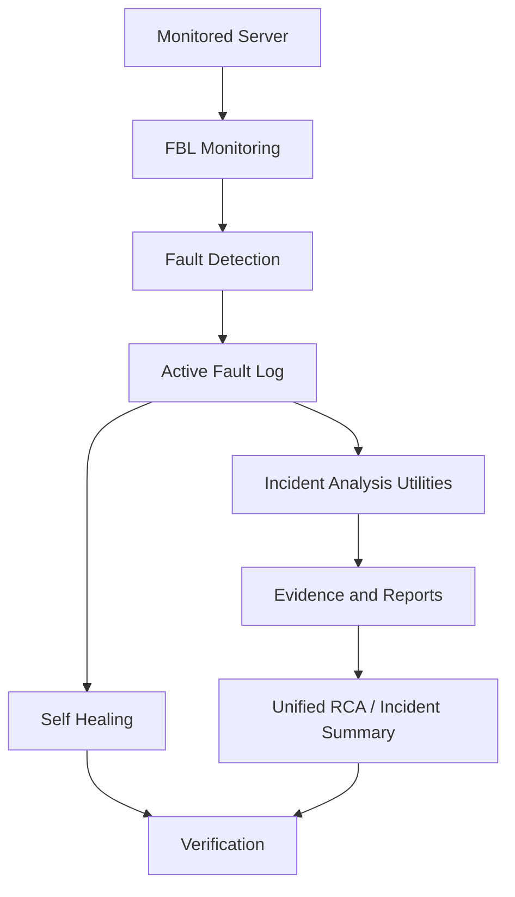

# Incident Analysis Utilities

FBL first detects the incident. **Incident Analysis Utilities** then collect evidence from different layers of the server. **Unified RCA** correlates those findings to identify the likely root cause. **Self Healing** remains a separate remediation layer, and **verification** confirms whether the problem was resolved.

Incident Analysis does **not** automatically run Self Healing.

## Architecture (mock / demo)

```text
                    ┌─────────────────────┐
                    │   Monitored Server  │
                    └──────────┬──────────┘
                               │
                               ▼
                    ┌─────────────────────┐
                    │  FBL Monitoring     │
                    │ CPU / GPU / RAM     │
                    │ Disk / NIC / IO     │
                    └──────────┬──────────┘
                               │
                               ▼
                    ┌─────────────────────┐
                    │   Fault Detection    │
                    └──────────┬──────────┘
                               │
                               ▼
                    ┌─────────────────────┐
                    │  Active Fault Log   │
                    └──────────┬──────────┘
                               │
              ┌────────────────┴────────────────┐
              │                                 │
              ▼                                 ▼
   ┌─────────────────────┐          ┌─────────────────────┐
   │ Incident Analysis   │          │    Self Healing     │
   │ Utilities           │          └──────────┬──────────┘
   ├─────────────────────┤                     │
   │ Analyze.sh          │                     ▼
   │ Health_Assess.sh    │          ┌─────────────────────┐
   │ Unified_RCA.sh      │          │ Verification        │
   │ ForensicV1.sh       │          └─────────────────────┘
   │ Stall Capture       │
   │ Pid500.sh           │
   └──────────┬──────────┘
              │
              ▼
   ┌─────────────────────┐
   │ Evidence & Reports  │
   └──────────┬──────────┘
              │
              ▼
   ┌─────────────────────┐
   │ Unified RCA /       │
   │ Incident Summary    │
   └─────────────────────┘
```



## Utilities

| Utility | Purpose | Output | When to Use |
| --- | --- | --- | --- |
| Analyze.sh | CPU, memory, storage, disk latency, filesystem analysis | Timestamped file under `/tmp` (or `INCIDENT_OUTPUT_DIR`) | Initial system health assessment |
| Health_Assess.sh | System + network + application assessment | `/tmp/telecom_health_<date>_<time>/` with `health_report.txt` and HTML | Comprehensive health assessment |
| Unified_RCA.sh | Correlates subsystem problems and identifies likely RCA | Script stdout parsed into primary cause / evidence | Root cause analysis |
| ForensicV1.sh | Process + infrastructure snapshot | Forensic output on disk; UI shows a summary only | Deep investigation |
| Stall Capture | `Stall_Capture_setup.sh` then `analyze_stall.sh` if present | Stall evidence under output root | Investigating an unresponsive / stalled server |
| Pid500.sh | Captures processes above 500% CPU | One or more `pid500_<timestamp>.log` files | Investigating abnormal CPU consumption |

## Where they appear in FBL

- **Active Fault Log → Fault Details → Incident Analysis Utilities** (runs are stored with the existing fault / incident id).
- **Utilities → Incident Analysis → Incident Analysis Utilities** (same tools; associate a fault id when possible).
- Self Healing stays in the **Recovery** panel and is not triggered by analysis results.

## Script locations

Default bundled directory (next to `CM.py`):

`incident_scripts/`

Override with environment variables (see `incident.env.example`):

| Variable | Script |
| --- | --- |
| `INCIDENT_SCRIPTS_DIR` | Directory containing all six scripts |
| `ANALYZE_SCRIPT` | `Analyze.sh` |
| `HEALTH_ASSESS_SCRIPT` | `Health_Assess.sh` |
| `UNIFIED_RCA_SCRIPT` | `Unified_RCA.sh` |
| `FORENSIC_SCRIPT` | `ForensicV1.sh` |
| `STALL_CAPTURE_SCRIPT` | `Stall_Capture_setup.sh` |
| `ANALYZE_STALL_SCRIPT` | Default `/usr/local/bin/analyze_stall.sh` |
| `PID500_SCRIPT` | `Pid500.sh` |
| `INCIDENT_OUTPUT_DIR` | Default `/tmp` |

Also searched: `/usr/local/fbl/incident/` and `/usr/local/bin/`.

Place site-specific copies of the original operator scripts on the ThinkStation if they differ from the bundled wrappers.

## How to run

1. Open an active fault.
2. In **Incident Analysis Utilities**, choose a card and **Run Analysis**.
3. Status moves `QUEUED` → `RUNNING` → `COMPLETED` / `FAILED` / `TIMEOUT`.
4. Use **Open HTML Report** (Health Assessment) or **View Raw Output**.

The browser never sends a shell command. The backend allowlists:

`Analyze.sh`, `Health_Assess.sh`, `Unified_RCA.sh`, `ForensicV1.sh`, `Stall_Capture_setup.sh`, `Pid500.sh`

## Privileges

- Most scripts only need permission to read `/proc`, run `ps`/`df`/`iostat`, and write under `/tmp`.
- **Stall Capture** may require root to install a persistent stall probe. FBL does **not** enable passwordless sudo. Optional `INCIDENT_STALL_SUDO=true` uses `sudo -n` (non-interactive; fails immediately if unauthorized).
- HTML reports are served only if the resolved path stays under `/tmp` (or `INCIDENT_OUTPUT_DIR`). Path traversal is rejected.

## Reports

Health Assessment writes `health_report.txt` and an HTML file under `/tmp/telecom_health_<date>_<time>/`. FBL detects `.html` files in that tree after the run and serves them at:

`GET /incident-analysis/report/<execution_id>`

## Mock / demo behavior

If `INCIDENT_ANALYSIS_DEMO=true`, **or** a synthetic `/demo/<component>/<severity>` fault is active **and** the real script is missing, FBL generates **labeled DEMO MODE** sample output. Simulated data is never mixed into a live script’s stdout.

When real scripts are present and executable, they are used even during a synthetic fault injection.

## Security and audit

Each execution logs timestamp, operator, incident id, utility, execution id, start/end, status, exit code, and output path (Flask logger `fbl_incident_analysis` plus SQLite `incident_analysis_executions`).

Forensic listings are truncated in the UI; the full snapshot stays on disk.

## API

| Method | Path |
| --- | --- |
| GET | `/incident-analysis/utilities` |
| POST | `/incident-analysis/run/{utility}` |
| GET | `/incident-analysis/status/{execution_id}` |
| GET | `/incident-analysis/result/{execution_id}` |
| GET | `/incident-analysis/report/{execution_id}` |
| GET | `/incident-analysis/raw/{execution_id}` |
| GET | `/incident-analysis/history?incident_id=` |
| GET | `/incident-analysis/summary/{incident_id}` |

Utility ids: `analyze`, `health`, `rca`, `forensic`, `stall`, `pid500`.

Deploy `fbl_incident_analysis.py`, `incident_scripts/`, and the updated `CM.py` / `telemetry_db.py` to the Linux collector and restart `python3 CM.py`.
